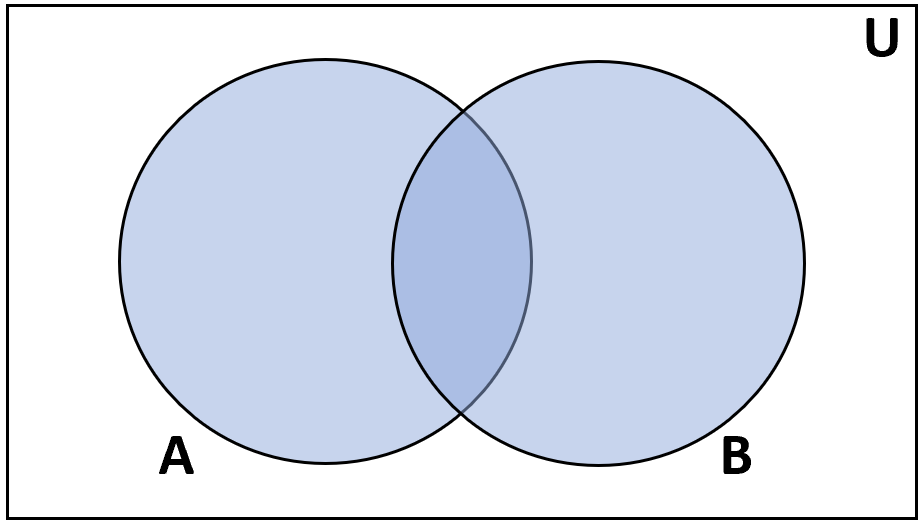
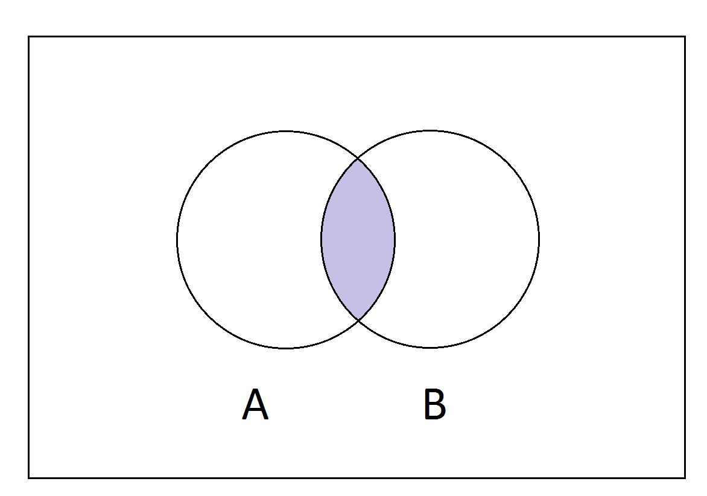
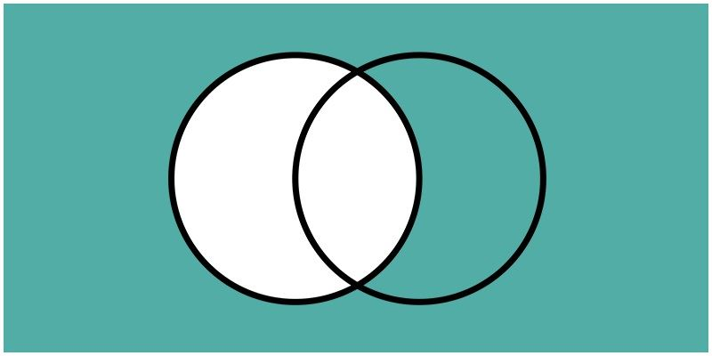
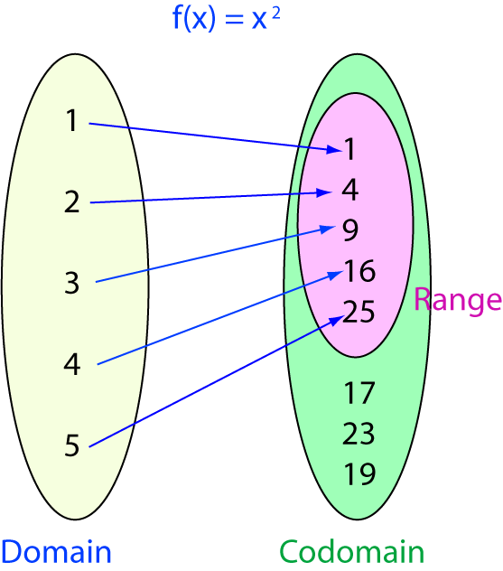

## Intro to Analysis Key Concepts {.tabset}

### Axioms of the Real Numbers

#### Completeness Axiom for the Real Numbers

**Definition:** Every non-empty subset A of $\mathbb{R}$ that is bounded above has a least upper bound. That is, $\exists x \in \mathbb{R}$ such that $\forall y \in A$ $x \geq y$. Similarly very non-empty subset A of $\mathbb{R}$ that is bounded below has a greatest lower bound. That is, $\exists x \in \mathbb{R}$ such that $\forall y \in A$ $x \leq y$. Thus every every non empty and bounded set has a supremum and infimum and is a real number.

Bounded above, bounded below, infimum, and supremum as defined in the "Sets" section of this documentation.


#### Well Ordering Principle

**Definition:** Every non-empty subset of $\mathbb{N}$ has a smallest element.

Note that this is not an axiom of the reals, but an axiom of the naturals. None the less it helps understand the nature of the reals.

#### Helpful Links

* [Completeness Axiom Youtube](https://users.math.msu.edu/users/tsendova/MTH299_F13/Lecture_33%20for%20student.pdf)
* [Completeness Axiom Youtube](https://youtu.be/pR_HD2WaN_k?si=HmiF_GcI_XhpXUe4)
* [Well Ordering Principle](https://math.libretexts.org/Courses/Monroe_Community_College/MTH_220_Discrete_Math/3%3A_Proof_Techniques/3.7%3A_The_Well-Ordering_Principle)


### Archimedean Principle

**Definition:** The set of of positive integers, $\mathbb{N} = {1,2,3,...}$ is not bounded above. That is, $\forall n \in \mathbb{N}$ $\exists n+1$ such that $n \leq n+1$

**Example:** Say we have a distance of 1 yard that we would like to travel and we can move at any lengths we choose. We decide that for every step we take, we will cross exactly half of the possible distance. Thus, we will take steps of $\frac{1}{2}$ of a yard, $\frac{1}{4}$ of a yard, $\frac{1}{8}$ of a yard, and so on.Going on like this we could never reach the maximum distance of one yard. This is just one example of the natural numbers being unbounded and thus an example of the archimedean property.

**Common Use:**

When proving and showing arbitrarily close distances, $\frac{1}{n}$ comes up frequently as it allows us to makes statements such as:

* For the set A = {x|$3 \leq x < 5 $}, by the Archimedean principle, $\forall x \in A$ $\exists y = x+\frac{1}{n}$ such that $x < y < 5$, and thus there is no maximum value in set A.

#### Helpful Links
* [Archimedean Principle Youtube](https://youtu.be/sG1FHUPdmxk?si=n4bJcrBfz0Jq-UEY)

### Sets

#### Notation

When speaking of sets we are talking about some group of numbers where no number is repeated. We represent a set with {}, for example, set A = {1,2,3}. The brackets identify the group of numbers not being different from the group of numbers when reordered, such that B = {2,1,3}, and A = B. This is simply a property of the set, not a property of the numbers, so this does not mean in set B, 2 < 1.

Some common sets of numbers are:

* The natural numbers, otherwise denoted as $\mathbb{N}$. These numbers are all positive whole numbers or 1,2,3,...
* The integers, otherwise denoted as $\mathbb{Z}$. These numbers are all whole numbers or ...,-2,-1,0,1,2,... 
* The rationals numbers, otherwise denoted as $\mathbb{Q}$. These numbers are all numbers that can be represented as $\frac{p}{q}$ where $q \neq 0$.
* The real numbers, otherwise denoted as $\mathbb{R}$. These numbers are composed of all of the previously mentioned sets.
* The empty, or null, set, otherwise denoted as $\emptyset$. This set contains no elements.

We can construct different sets with some of the following notation:

* Set builder notation, which can be defined as A = {x|condition of x}. For example, A = {x | $3 \leq x < 5 $} which is all numbers between 3 and 5 or A = {2x | $3 \leq x < 5 $} which is the same as the last but all numbers are multiplied by a factor of two.
* $A \subset \mathbb{R}$ which is a  non-definitive way of saying that A is some proper subset (does not contain all elements from the initial set) of the real numbers. There is also the symbol $\subseteq$ which indicates a non-proper subset, meaning the subset could potentially have all of the same elements as the initial set.


#### Common Set Definitions


**Union:** The union of two sets, otherwise denoted as $A \cup B$ for sets A and B, is a set that contains all elements from both sets. Referring to the venn diagram below, the union of A and B would be all elements that fit into the A and B circles and only those circles.

```{r}

```

Not only can we denote the union between two sets, we can also denote the union of any sets. For example, $A \cup B \cup C$ would be the union of three sets, including elements from all of them. If A = {1,2,3}, B = {4,5,6}, and C = {7,8,9}, then $A \cup B \cup C$ = {1,2,3,4,5,6,7,8,9}

**Intersection:** The intersection of sets, otherwise denoted by $A \cap B$ for sets A and B, is a set the contains only elements that are shared between sets. Once again referring to a venn diagram, as can be seen below, the intersection of A and B would be all elements that fit into both A and B circles and just those elements.

```{r}

```

For example, if we were to define sets A = {1,2,3}, B = {2,3,4}, and C = {3,4,5}, then the following would be defined as:

* $A \cap B \cap C$ = {3}
* $A \cap B$ = {2,3}
* $B \cap C$ = {3,4}
* $A \cap C$ = {3}

**Complement:** The complement of set A, denoted as $A'$ or $\bar{A}$, is the set of all elements in the universal set and in A. When dealing with complements it is important to understand that the universal set in question is situational, the basic idea is that complement is every element in the situation that is not a part of A. The venn diagram displays this by highlighting all elements of the complement of the white circle in blue. For example, for $A \subset \mathbb{R}$ where $\forall x \in A$ $x < 5$, $\bar{A}$ is all elements of the reals where x is greater than or equal to 5.

```{r}

```

**Supremums and Infimums**

Set A = {$x \in \mathbb{R} $| $3 \leq x < 5$}. For all elements of A, $3 \leq x$, and as 3 is the smallest element in this set, we would call this value a minimum of the set. The minimum denotes the smallest element a set can take. 3 is what we define as the greatest lower bound of the set. We can define a lower bound as any value such that all values in set A are greater than or equal to the value. For example, -51 counts as a lower bound of A. While there is an infinite number of lower bounds possible, only one is critical and that is the greatest lower bound. The greatest can be defined as the largest lower bound possible, meaning all lower bounds are less than this value and all values in A are greater than it. This value is also denoted as the infimum of the set.

For set A defined above, 5 is not a maximum of A. While 3 can be  defined as a minimum because it is in A, 5 is simply bounding A, thus meaning that by the archimedean principle there is an infinite amount of numbers less than 5 but in A, so there is no x such that x is greater than or equal to all values in a. 5 is what we call the least upper bound. We can define an upper bound as any value in which all elements of set A are less than the value. For example, 117 is an upper bound of the set A. While there is an infinite amount of upper bounds, only one is critical and that is the least upper bound. The least upper bound can be defined as the smallest upper bound possible, meaning all upper bounds are greater than it and all values in the set are less than or equal to it. This value can also be denoted as the supremum of the set.

**Limit Point:** 

A limit point of set $A$ can be defined as point $P$ where all sets that contain $P$ also contain some other point $L$ which is also in A. For example, in the set A = {$x \in \mathbb{R} $| $3 \leq x < 5$}, 4.9 is a limit point of A because no matter what set bounds that are put around it, by the archimedean principle, there will always be some other number that is arbitrarily close to 4.9 such that any set that contains 4.9 will also have to contain some other point $L$ such that L is in set A.

#### Helpful Links

* [Boston University Set Theory](https://www.bu.edu/linguistics/UG/course/lx502/_docs/lx502-basic%20set%20theory.pdf)
* [Intro to Set Theory Youtube](https://www.youtube.com/watch?v=tyDKR4FG3Yw&pp=ygUTaW50cm8gdG8gc2V0IHRoZW9yeQ%3D%3D)
* [Supremum and Infimum Youtube](https://youtu.be/8Cyvdv7Sm2s?si=h51lB_6q3CCrjF9k)

### Formal Logic

When dealing with formal logic, we are concerned with the truth of statements. For example, "it rained today." This is a statement and we can represent this statement as variable $P$. This statement's truth value changes depending on the day, on days it has rained $P = True$, on days that it has not rained $P = False$. This is the basis for the fundamentals of formal logic.

#### Notation

With more notation, we can expand upon this basis of formal logic. With these notations we can interact with multiple statements and really see the strength of formal logic.

**Binary Logical Connectives:**

For the statements $P=True$ and $Q=False$ consider the following table. (We will also show the negation statement here even though it is not a logical connective)

$$
\begin{array}{|r|r|c|}
\hline
Symbol & Explanation & Example\\
\hline
P \land Q & \text{Conjuction, P AND Q, both must be true}&P \land Q=False\\
P \lor Q&\text{Disjunction, P OR Q, only one must be true}&P \lor Q = True\\
P \rightarrow Q &\text{Conditional, P THEN Q, will cover more later}&P\rightarrow Q=False \\
P\leftrightarrow Q&\text{Biconditional, P ONLY IF Q, True if P=Q}&P\leftrightarrow Q = False\\
\neg P&\text{Negation, NOT P, opposite of the original truth value}&\neg P = False \\
\hline
\end{array}
$$
**Predicates & Quantifiers:** 

With formal logic we often find ourselves concerned with how a statement aligns with a set. For example, we have statement P, defined as P = "x < 5". We have set A = {x | 3 < x < 7}. We want to know the truth value of P in relation to elements of set A. P(x) is an example of a "predicate", this denotes the statement P on any given x, so when asking about P in relation to elements of A which are given by x, we can say P(x). The following table explains quantifiers. These allow us to expand upon the idea of a predicate. All examples will be in relation to the previously defined example

$$
\begin{array}{|r|r|c|}
\hline
Symbol & Explanation & Example\\
\hline
\forall x &\text{FOR ALL x}& \forall x \in A, P(x) = False\\
\exists x &\text{THERE EXISTS an x} & \exists x \in A, P(x)=True\\
\hline
\end{array}
$$

In the table above, the for all quantifier returns false for the given predicate because within A, we can find elements that are not less than 5, such as 6. the exists quantifier returns true for this given predicate because with A, we can find at least one element that is less than 5, such as 4.

#### Truth Tables

One application of formal logic is truth tables. These tables take some complex statement and for every possible truth value of the simple values, computes the truth value of the complex statement. This is helpful in recognizing that something called "logical equivalence" which we will go into later. The following truth table gives all possible truth values for statement $P \rightarrow Q$ in order to better understand the conditional connective. "True" will be identified with a "T" and "False" will be identified with an "F."

$$
\begin{array}{|r|r|c|}
\hline
P & Q & P \rightarrow Q\\
\hline
T & T & T \\
T & F & F \\
F & T & T \\
F & F & T \\
\hline
\end{array}
$$

As can be seen in the above table, the conditional statement is only interested in when the first statement is true. The conditionals says "When P is some truth value then Q is some truth value", so when P is false, this statement has no effect on Q and thus the statement P then Q is always true. The only instance of P then Q being false is when P is true then Q is false because it is now saying that because something true has occurred, then something false happens, which is logically incorrect.

Another example of a truth table can be seen below.

$$
\begin{array}{|r|r|c|}
\hline
P & Q & P \land Q\\
\hline
T & T & T \\
T & F & F \\
F & T & F \\
F & F & F \\
\hline
\end{array}
$$

#### Logical Equivalence

Logical equivalence can be seen by expanding the truth tables to display the truth values of multiple complex statements. By expanding these tables we can determine if two complex statements have the same truth value for every possible truth value of the simple statements that they are comprised of. When the complex statements show themselves to result in the same truth values we call these statements "logically equivalent." Below is a famous example of this called "de Morgan's Law".

$$
\begin{array}{|r|r|c|c|}
\hline
P & Q & \neg (P \land Q) & \neg P \lor \neg Q\\
\hline
T & T & F & F\\
T & F & T & T\\
F & T & T & T\\
F & F & T & T\\
\hline
\end{array}
$$

As can be seen in the table the statements $\neg (P \land Q)$ and $\neg P \lor \neg Q$ both result in the exact same truth values for every truth value of P and Q, thus making them logically equivalence.

One important concept of logical equivalence is inverse, converse, and contrapostive of conditional statements. The definitions of these cane be seen in the table below.

$$
\begin{array}{|r|r|c|}
\hline
Name& Statement & Explanation \\
\hline
Conditional & P \rightarrow Q & \text{P then Q} \\
Converse & Q \rightarrow P & \text{Q then P} \\
Inverse &  \neg P \rightarrow \neg Q & \text{If not P then not Q}\\
Contrapositive &  \neg Q \rightarrow \neg P & \text{If not Q then not P}\\
\hline
\end{array}
$$

These definitions are good to know, however, what is really amazing about them is their resulting truth table. This table can be seen below.

$$
\begin{array}{|r|r|}
\hline
P& Q & P \rightarrow Q & Q \rightarrow P & \neg P \rightarrow \neg Q & \neg Q \rightarrow \neg P\\
\hline
T & T &  T & T & T & T\\
T & F &  F & T & T & F\\
F & T & T & F & F & T\\
F & F & T & T & T & T\\
\hline
\end{array}
$$

Looking at this truth table we can quickly recognize that the conditional is logically equivalent to the contrapositive and the converse is logically equivalent to the inverse. This not particularly powerful on its own, but when we begin proving statements that follow the structure of $P \rightarrow Q$ we can instead prove the contrapositive if it is easier.

#### Helpful Links

* [Conditional Statements and Logical Equivalence Youtube](https://www.youtube.com/watch?v=jLB5nCORLIg)
* [Intro to Formal Logic Youtube](https://youtu.be/q2eyZZK-OIk?si=_Z51UIXf2Rwk2zx5)
* [Limit Points Youtube](https://youtu.be/RmsvftFNMtE?si=9donGOO5LxEVXooa)

### Types of Proofs

#### Direct and Contrapositive

A direct proof is based on the conditional statement $P\rightarrow Q$. Applying this to a real problem we could say something like if $n$ is even, then so is $n^2$. This proof is direct because use a true statement to show that another statement must be either true or false because of it. We will give an example of this proof by proving the example stated previously.

**Prove if** $n$ **is even, so is** $n^2$.

Assume $n$ is an even number. Because $n$ is even, $n = 2k$ for some $k$. Now, $n^2 = (2k^2) = 2(2k^2)$. Let $j = 2k^2$, then $n^2 = 2j$, and by the same logic that says $n$ is even, $n^2$ is also even.

Unfortunately, sometimes a direct proof is to complicated to prove, so we must find a different way to prove it. As demonstrated in the "Sets" section of this document, $P \rightarrow Q$ is logically equivalent to $\neg Q \rightarrow \neg P$, so logically, if the contrapositive is true, the direct conditional is also true. This is handy as it gives us a work around to solving direct proofs that are to complicated to do directly but much more manageable in their contrapositive state. An example of this type of proof is below.

**Prove if** $n>0$ **and** $4^n -1$ **is prime, then n is odd**

Assume $n=2k$ (definition of even), then $4^n - 1 = 4^{2k} - 1 = (4^k-1)(4^k + 1)$. Therefore, $4^n -1$ factors, and by definition is not prime.

(Note that these examples have been drawn from [Introduction to Higher Mathematics, Keef&Guichard](https://www.whitman.edu/mathematics/higher_math_online/))

#### Contradiction

Contradiction proof is likely one of the easiest types of proof to understand and often makes its way into several other types of proofs. The idea of this proof type is that we want to show something is true, so we instead assume it's false. From there we show that there is no way the false statement could be true and thus the opposite must be true. We will not include an example in this section, instead look to the "Uniqueness" section where we prove the uniqueness of supremums and infimums by contradiction.

#### Induction

Another powerful proving method is called induction. This proving style is based around the concept that if one element holds true then all elements will hold true. This is almost always used for proofs regarding sequences and series that increment over the natural numbers. This is a result of the fact that the proof style is meant for proving an infinite series of events. For example, you want to make a statement about walking up an infinite stair case. You must first start by showing that there even is a first step. After showing the existence of this, we then make an abstract statement about step k and assume that what we observed in step k is true. If step k is true, then step k+1 should follow the pattern that we assumed would happen in the next step. If this k+1 step proves to be what we thought it would be, then we know every other step will follow suit. Below is an example of this proof style.

**Prove** $S_n = 1^3 + 2^3 + 3^3 +...+n^3 = (\frac{n(n+1)}{2})^2$:

Suppose $\forall k \in \mathbb{N}$ such that $S_k = (\frac{k(k+1)}{2})^2 = 1^3 + 2^3 + ... + k^3$ is true. It follows that $S_{k+1}$ is $1^3 + 2^3 + ... + k^3 + (k+1)^3 = (\frac{(k+1)(k+2)}{2})^2 = \frac{(k+1)^2(k+2)^2}{2} = \frac{(k+1)^2}{4}(k^2 + 4k + 4) = \\ (\frac{k(k+1)}{2})^2 + k(k+1)^2+(k+1)^2 = (\frac{k(k+1)}{2})^2 + (k^3 + 3k^2 + 3k + 1) = \\ (\frac{k(k+1)}{2})^2 + (k+1)^3$  

Thus, $S_{k+1} = S_k + (k+1)^3$, so if $S_k$ is true, then $S_{k+1}$ must also be true.


#### Uniqueness

An important type of proof in analysis is a proof of uniqueness. Overall this proof is not to complicated as the goal of it is showing that there cannot be two values that fulfill a particular definitions. A frequent way of doing these proofs is through contradiction, first assuming that there is two of something and then showing that those values have to be the same, however, there is no set method for these proofs. I will provide two examples below proving that the infimum and supremum of a set is unique. 

**Infimum Uniqueness:**

Let $m$ and $n$ be infimums of set $S \subset \mathbb{R}$ and set A = {$y \in \mathbb{R}|\forall x \in S, y \leq x$}. Given that $n$ is an infimum of $S$, $\forall x \forall y$ $y \leq n \leq x$. Similarly, $\forall x \forall y$ $y \leq m \leq x$, so $\forall x \forall y$ $y \leq n = m \leq x$, thus the infimum of S is unique.

**Supremum Uniqueness:**

Let $m$ and $n$ be supremums of set $S \subset \mathbb{R}$ and set A = {$y \in \mathbb{R}|\forall x \in S, y \geq x$}. Given that $n$ is an supremum of $S$, $\forall x \forall y$ $x \leq n \leq y$. Similarly, $\forall x \forall y$ $x \leq m \leq y$, so $\forall x \forall y$ $x \leq n = m \leq y$, thus the supremum of S is unique.

#### Epsilon-N and Epsilon-Delta

We will not cover these proofs here but in the "Functions" section of this document. Keep in mind that these proofs are incredibly important to understand for a beginning idea of the rigourous treatment of calculus that occurs with Analysis.

#### Helpful Links

* [Introduction to Higher Mathematics, Keef&Guichard](https://www.whitman.edu/mathematics/higher_math_online/)
* [Uniqueness Proofs Youtube](https://youtu.be/uNbt-ABKpj4?si=RUVhTR7lZoQaxBPL)
* [Direct Proofs Youtube](https://youtu.be/YFZzLQN5qOU?si=_C5PVcJAnrr-Y087)
* [Contrapositive Proofs Youtube](https://youtu.be/X-hJ7krLBn0?si=8oncp7wcDSZ4PQ8f)
* [Proof by Contradiction](https://youtu.be/sRDwsfNDXak?si=9px-uqspIuDKuDb5)
* [Induction Proofs](https://youtu.be/wblW_M_HVQ8?si=Oi0nOFFmHBdCKxZq)

### Functions

#### Definitions

For the function $f: x \rightarrow y$ defined as $f(x) = x$ as many pieces that make it up. Understanding each piece of a function is critical to understanding how we use functions within analysis. We can define the pieces of the functions as follows.

**Function:** A relationship between variables.

Typically we understand these as a relationship between the $y$ and $x$ variables. We define these relationships in f(x) = y. This explains the relationship by saying for every x input of our function, there is also a y input. One key thing to note is that a function cannot be well defined if one input x has multiple outputs y. In the case of our function, f(x) is a one-to-one relationship where for every x input, the y output is the same value as x.

This function is inredibly simple, but functions are not limited to this. f(x) can take the for form of $x^2$ or $2x + 50x^2$ or any other of the infinite other functions. Not only can these functions be a relationship between 1 variable, but they can also represent the relationship of many variable. For example z = f(x,y). This function takes in two variable inputs and outputs a z.

**Domain:** The set of all possible inputs for the function.

In the function we defined at the start we stated $f:x \rightarrow y$. The x in this statement is what we define as our domain. This x is the set of all possible inputs for our functions and this set could be anything we want. This set could be $\mathbb{R}$ or it could A = {1,2,3,4}. When we define our domain, our function will only be able to use values in that set as inputs for x. For the more complicated multi-variable functions, each input would be a set. In our z = f(x,y), a possible input could be {x=0,y=0}, and a possible domain could be A = {(0,0),(1,1),(2,2)}

**Range:** The set of all possible outputs for the function.

The range is dependent on the domain of the function, because if don't have any input values in the domain that could result in a specific output value, then that output value cannot be in the range because it is not a possible value. For example, if our domain is A = {1,2,3,4} and our function $f(x)=x$, then our range would be set B = {1,2,3,4} because these are the only possible outputs of our function given the set of inputs.

The range is also a subset of what we call the "co-domain." The co-domain could be considered all values of the range and all other possible values of the range. This is a little complex because it is not intuitive, but the diagram below helps elaborate. While the domain maps exclusively onto the values of the range, there is still some values that are not mapped onto. The co-domain is the set of these values and the range. This happens in instances such as $f:\mathbb{N} \rightarrow \mathbb{N}$ where $f(x)=x^2$. This function will only map to values that have a whole number square root, thus missing many numbers in the co-domain and only mapping to values in the range. In the function we defined at the start we stated $f:x \rightarrow y$. The y in this statement is what we define as our co-domain. 

```{r}

```

**Image:** The image of x under function f is f(x).

This can also be described as the output of function f given the input x. In the case of sets, the image of our function domain is the function range. The image defines how f transforms an input to an output.


**Injective:** Every input has a unique output that is not the same as another input. This is commonly referred to as being "one-to-one".

Going back to the function $f(x)=x$ with domain A = {1,2,3,4} and range B = {1,2,3,4}, we can see that every single input that goes into f(x) has a unique output that no other input can result in. For this function in particular, there is actually no domain in which $f$ will not be injective; for sets $\mathbb{R}$, $\mathbb{N}$, or any other set, every image under $f$ will be unique to the input x. $f(x)=x^2$ with domain $\mathbb{R}$ is an example of a function that is not injective. Consider x = -2 and x = 2. Under $f$ both have an image 4, thus this function is not one-to-one with this domain and is not injective.

**Surjective:** Every possible output in the co-domain has some input in the domain that has the image of that output under $f$. This is commonly referred to as being "onto".

In our example using function $f(x)=x$ with domain A = {1,2,3,4} and range B = {1,2,3,4} we can say that function $f$ is "onto" or surjective if $f:A \rightarrow B$. However, if $f: A \rightarrow \mathbb{R}$, then $f$ is not surjective because f only maps to four elements of the co-domain. When checking if a function is onto, the goal is to see if every element in the co-domain is the image of an element in the domain, the elements in the co-domain can even be the image of multiple elements in the domain, as long as every element in the co-domain is mapped onto.


**Bijective:** A function $f$ is bijective if $f$ is both injective and surjective, meaning $f$ maps every element in domain uniquely onto every element of the co-domain.

Once again going back to the example of function $f(x)=x$ with domain A = {1,2,3,4} and range B = {1,2,3,4}, $f$ is a bijective function as it is both surjective and injective. The function $f: \mathbb{R} \rightarrow \mathbb{R}$ where $f(x) = x^2$ is not one-to-one or onto. If $f: \mathbb{R} \rightarrow \mathbb{R}^+$, then $f$ is onto because every element in the co-domain is mapped onto. If $f: \mathbb{R}^+ \rightarrow \mathbb{R}$, then $f$ is one-to-one because every element in the domain is uniquely mapped to an element in the co-domain. Finally if $f: \mathbb{R}^+ \rightarrow \mathbb{R}^+$, then $f$ is bijective because every element from the domain is uniquely mapped onto every element in the co-domain.

#### Proofs

There are several types of proofs essential to working with functions. The following will cover some of the basic proofs for functions.

**Functions of Sets:**

When speaking on functions of sets were are talking about the image of a set under $f$. For example, with sets A and B, $f A \rightarrow B$, set B is the image of set A. This gets more complicated when discussing the image of sets like $A \cap B$. We use functions of sets proof to show equivalence. For example with proofs of this nature we get the following equality of $f(A \cap B) = f(A) \cap f(B)$. When doing these proof we must show that the proof works starting at either side of the equivalence relation. An example of this proof is as follows:

For any set A,B, and C, prove $A - (B \cap C)=(A-B) \cup (A-C)$.

Let $x \in A - (B \cap C)$, thus $x \in A$ and $x \notin (B \cap C)$. If $x \notin (B \cap C)$, it is possible $x \in B$ or $x \in C$, but not both. If $x \in B$, $x \notin (A-B)$ and $x \in (A-C)$. Similarly, If $x \in C$, $x \notin (A-C)$ and $x \in (A-B)$. If $x \notin B,C$, $x \in (A-C), (A-B)$, so $x \in ((A-C) \cap (A-B))$. Conversely, $x \in ((A-C) \cap (A-B))$, so $x \in (A-B)$, $x \in (A-C)$, or both. If $x \in (A-B)$ and $x \notin (A-C)$, $x\in A,C$ and $x \notin B$, so $x \in A$ and $x \notin (B \cap C)$, thus $x \in A - (B \cap C)$. Similarly if $x \in (A-C)$ and $x \notin (A-B)$, $x\in A,B$ and $x \notin C$, so $x \in A$ and $x \notin (B \cap C)$, thus $x \in A - (B \cap C)$. Finally, if $x \in (A-B)$ and $x \in (A-C)$, $x \in A$ and $x \notin A,B$, so $x \in A - (B \cap C)$ and $A - (B \cap C)=(A-B) \cup (A-C)$.

**Injective, Surjective, Bijective, Function Composition, and Inverses:**

Function composition is an operation that takes multiple functions, say $f$ and $g$ and creates function $h(x) = g(f(x))$ which can be denoted as $g \circ f$. Typically with these function proofs we are interested in proving injectivity and surjectivity of function. An example of these proofs follow as:

* Given $f: A \rightarrow B$, $g: B \rightarrow C$, and $f$ and $g$ are both injective, prove $g \circ f$ is injective.

Given that $f: A \rightarrow B$, $g: B \rightarrow C$ are injective, $\forall x \in A$ if $f(x_1) = f(x_2)$, then $x_1 = x_2$ and $\forall y \in B $, if $g(y_1) = g(y_2)$ then $y_1 = y_2$. Therefore if $g(f(x_1)) = g(f(x_2))$, then $f(x_1) = f(x_2)$ and $x_1 = x_2$. Thus if $f$ and $g$ are injective, then $(g \circ f)$ is injective.

* Given $f: A \rightarrow B$, $g: B \rightarrow C$, and $f$ and $g$ are both surjective, prove $g \circ f$ is surjective.

Given that $f: A \rightarrow B$, $g: B \rightarrow C$ are surjective, then $\forall z \in C$ $\exists y \in B$ such that $g(y) = z$ and $\forall y \in B$ $\exists x \in A$ such that $f(x) = y$. It follows that $\forall z$  $\exists f(x)$ such that $g(f(x)) = z$, therefore if $f$ and $g$ are surjective, then $(g \circ f)$ is surjective.

Another proof of interest to us when dealing with functions is proofs regarding the inverse, particularly the composition of a function and its inverse. An inverse of a function $f(x)$ can be thought of best as an "undo" of everything $f(x)$ did to the domain. The inverse is denoted as $f^{-1}(y)$ and takes the range of $f$ as it's domain and the domain of $f$ as it's range. Something interesting about $f^{-1}$ is that it does not have to be well defined because the original function can possibly map multiple elements onto the same element. In situations where there is a $y$ such that $f^{-1}(y)$ results in set of $x$, we simply say that $f^{-1}(y) $ = {x}. As a result of this, we can no longer makes statements such as $y=f(x)$, instead we must state $x \in f^{-1}(y)$, however, if a function is injective we can still use the old notation, but we cannot automatically assume any function is injective.

There is many proofs that can make use of inverse functions, most are concerned with proving the nature of the function. These can be function of sets proofs, compostion proofs, and more. Below is an example 

**Sequence Convergence/Divergence:**

Sequences are incredibly important for many reasons, one being the fact that we can use them to observe behaviors of these functions, such as what they do when x goes off to infinity or what happens when the function approaches a specific number. Epsilon-N proofs allow us to prove whether these function sequences converge or diverge as the sequence goes off to infinity. The epsilon delta  proofs allow us to prove whether these function sequences converge or diverge as the sequence goes to a specific x. We will go into detail how each of these proofs work.


**Epsilon-N**

The simplest type of epsilon proof, the logic behind this proof is as follows: $\forall \epsilon > 0$  $\exists N \in \mathbb{N}$ such that $n \geq N \rightarrow |a_n - L|<\epsilon$. Informally we can describe this proof as saying for any number you could choose that is greater than 0, there exists a natural number N, such that as n goes beyond N, the difference between the sequence and some limit L will be less than epsilon. We could also describe this as saying that after a certain point in the sequence, $a_n - L$ is infinitesimally close to 0. We will show a convergent and divergent sequence proof.


* Prove $\text{lim}_{n \rightarrow \infty} \frac{2n+1}{n}$ converges to 2.


$\forall \epsilon > 0$ consider $\frac{2n+1}{n}$. We have $|\frac{2n+1}{n}-2|$ = $|\frac{2n+1}{n}-\frac{2n}{n}|$ = $|\frac{2n+1 -2n}{n}|$ = $\frac{1}{n}$ and by the Archimedean principle, $\frac{1}{n} < \epsilon$. Thus, $\text{lim}_{n \rightarrow \infty} \frac{2n+1}{n}$ converges to 2.


* Prove $\text{lim}_{n \rightarrow \infty} \frac{5n^2}{n}$ does not converge.


$\forall \epsilon > 0$ consider $\frac{5n^2}{n}$. We have $\frac{5n^2}{n}$ = $5n$ and by the Archimedean principle, this sequence is unbounded. As this sequence is unbounded, $\forall N \in \mathbb{N}$, when $n \geq N$, there is no such L such that $|\frac{5n^2}{n} - L| < \epsilon$. Thus, $\text{lim}_{n \rightarrow \infty} \frac{5n^2}{n}$ does not converge.

**Epsilon-Delta**

The logic behind an epsilon proof is similar but not quite the same as an epsilon-N proof, the reason for this is that in an epsilon-delta proof, the position of x needs to be taken into account. The logic behind this proof is as follows: Consider $\text{lim}_{x \rightarrow a} f(x) = L$, $\forall \epsilon > 0$ $\exists \delta > 0 $ such that $0 < |x-a| < \delta \rightarrow |f(x)-L|<\epsilon$. We could also describe this as saying that for all epsilon greater than 0, there exists a delta, or some number very close to a, such that within this delta, for some limit $L$, $f(x) - L$ is infinitesimally close to 0. We will show a convergent and divergent sequence proof.

* Prove $\text{lim}_{n \rightarrow 0} -2x^2 + 3x -1 = -1$.

Let $\epsilon > 0$ and choose $\delta < min(1, \epsilon)$. Then when $|x+0|<\delta$ $|-2x^2 + 3x - 1 + 1| =|-2x^2+3x|$. Since $|x|<\delta$ $|-2x^2+3x| < |-2\delta^2+3\delta|$. From $\delta < 1$ we have $\delta^2 < \delta$, thus $|-2\delta^2+3\delta| < |-2\delta+3\delta| = |\delta| < \epsilon$. Therefore $\text{lim}_{n \rightarrow 0} -2x^2 + 3x -1 = -1$

* Prove $\text{lim}_{n \rightarrow 3} \frac{1}{x-3}$ does not converge.

Let $\epsilon > 0$ and choose any $N \in \mathbb{N}$. Let $|x-3|<\delta < 1$ and $x = \frac{\delta}{N}$. Then $f(x) = \frac{1}{3 + \frac{\delta}{N} - 3} = \frac{N}{\delta}$. As $\delta < 1$, $\frac{N}{\delta} > N$. Thus $f(x)$ is unbounded and $\forall L \in \mathbb{R}$ $f(x) \neq L$ implying $|f(x) - L|$ cannot be less than $\epsilon$. Therefore, $\text{lim}_{n \rightarrow 3} \frac{1}{x-3}$ does not converge.

#### Helpful Links

* [Functions, Domain, Range, and Co-domain Youtube](https://www.youtube.com/watch?v=B3548wnUjag)
* [Injective, Surjective, Bijective Youtube](https://youtu.be/xKNX8BUWR0g?si=ABzmwHHA3TG-tfoT)
* [Epsilon-N Proofs Youtube](https://youtu.be/9JMFLzHtljA?si=4_fdekJGLlQLnFMw)
* [Epsilon-Delta Proofs Youtube](https://youtu.be/XLtkDkqk54Y?si=nwN3Ub7SegXaP1ZV)
* [Inverse and Composition Youtube](https://youtu.be/GEgFmxxOJno?si=W0VZng3xLwI23GvA)
* [Functions of Sets Proof](https://youtu.be/HMtB-QUpP2A?si=czTKNSmiz6khAbI7)
